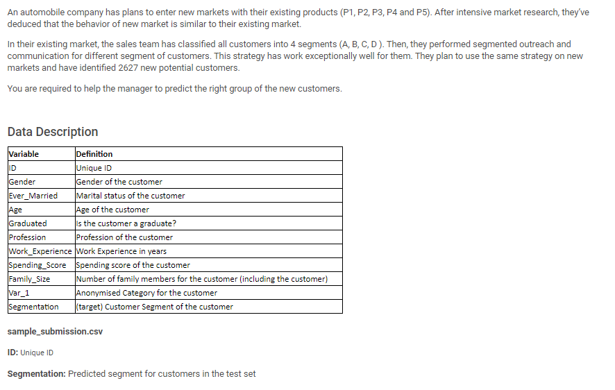
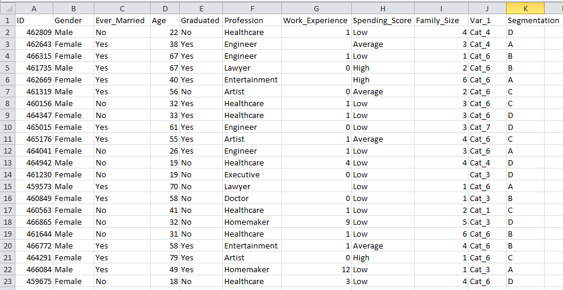

# Janatahack-Customer-Segmentation
Rank 2 Public LB Solution
# Problem Statement

## Data at a Glance
 
    
## Dependencies
* Python >3.6
* pandas
* numpy
* scikit-learn
* matplotlib
* seaborn
* lightgbm
* catboost
* xgboost
* rfpimp
* jupyter notebook

## Install dependencies
```
Pandas:           $ pip install pandas
numpy:            $ pip install numpy
scikit-learn:     $ pip install -U scikit-learn
matplotlib:       $ pip install matplotlib 
seaborn:          $ pip install seaborn
lightgbm:         $ pip install lightgbm
xgboost:          $ pip install xgboost
rfpimp:           $ pip install rfpimp
catboost:         $ pip install catboost
```

## Usage
* Run the code given in ipython notebook `Final.ipynb`

## Contributors
[Sai Krithik](https://github.com/saikrithik) & [Karan Juneja](https://github.com/karan171)
